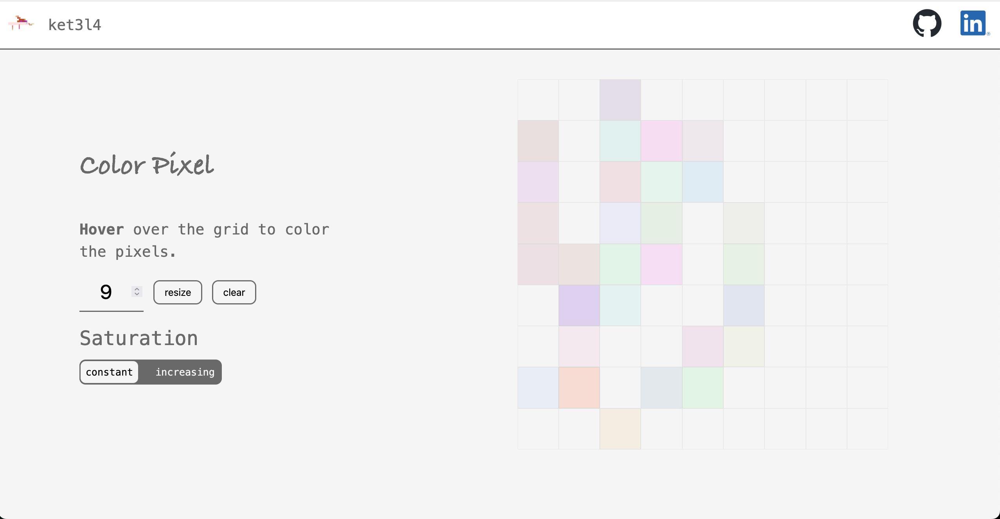

### Color Pixel

A coloring pixel webpage I made while going through [The Odin Project](https://www.theodinproject.com/lessons/foundations-etch-a-sketch). 
Based on an "Etch a Sketch", but with random colors and more!!

Inspired from [Captainairauk's](https://github.com/captainnairauk) own [version](https://captainnairauk.github.io/etch-a-sketch/).

